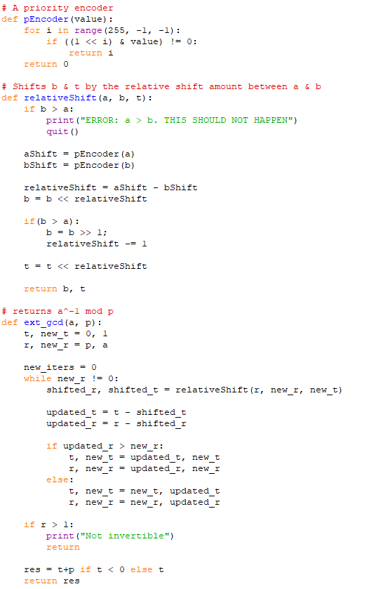
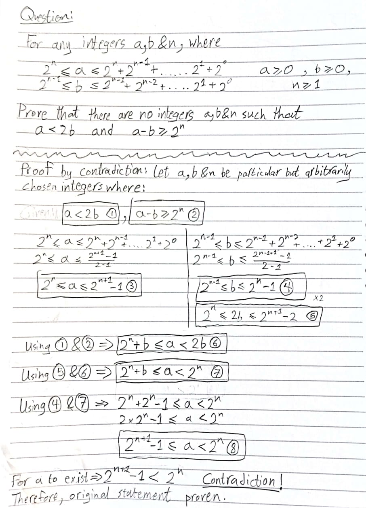
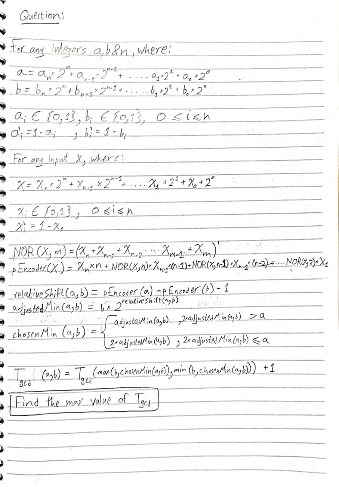
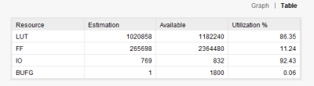

# VHDL Pipelined Modular Inversion

This is a pipelined implementation of modular inversion in VHDL. This can be used in RSA/ECDSA encryption/cracking. Reference (but quick and dirty) python code that converts a bitcoin private key to public key is in `reference_code.py`.

## Algorithm
The algorithm used is a modified version of the extended eclaudian algorithm which avoids using the division/remainder operations:  

I was able to proof that the algorithm takes a maximum of `n*2` iterations (where `n` is the number of bits):  

Through experimentation and trial&error, it seems that the algorithm would only take `n` iterations, but I wasn't able to prove it:  

## Results
In order to get a throughput of 1 modular inversion operation per clock cycle, 255 iteration modules have been connected in series to form a pipeline. This had the following synthesis results on a Xilinix UltraScale+ FPGA:  

